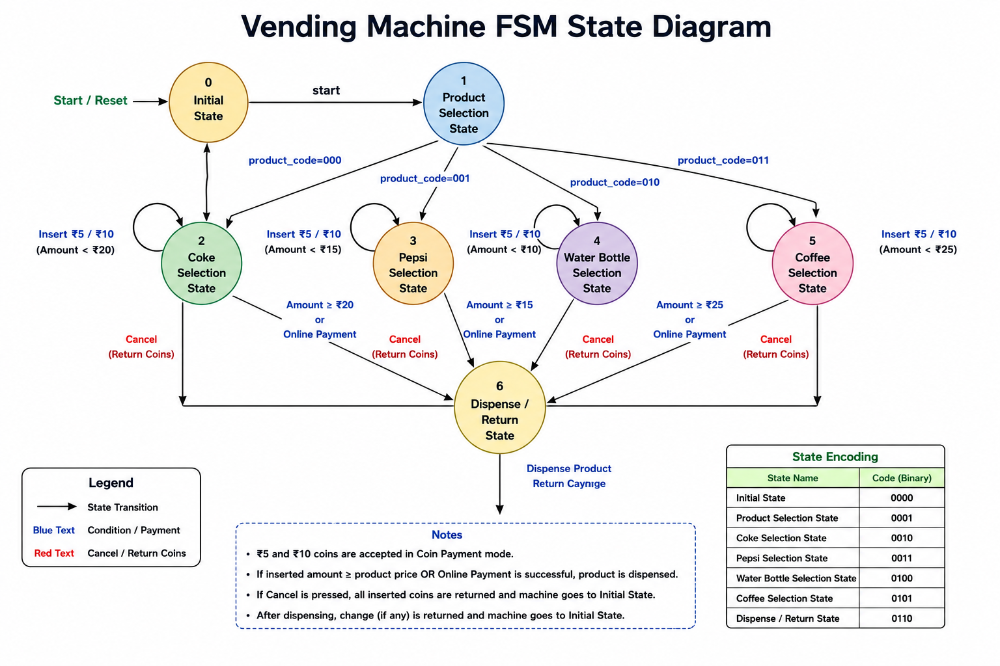
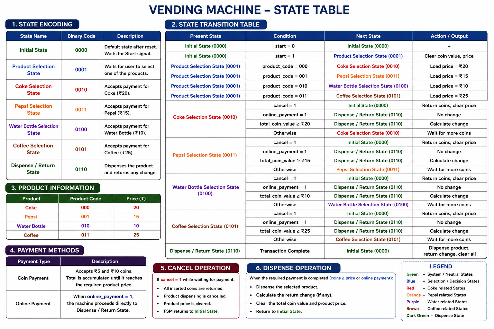
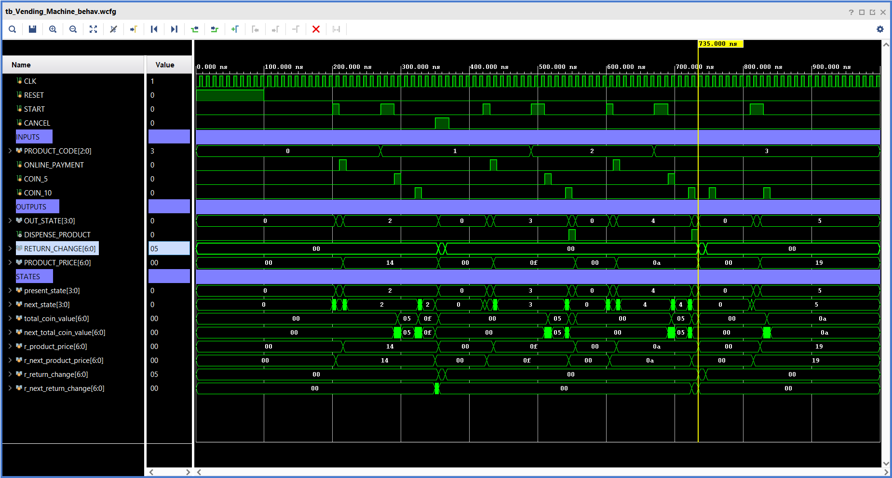
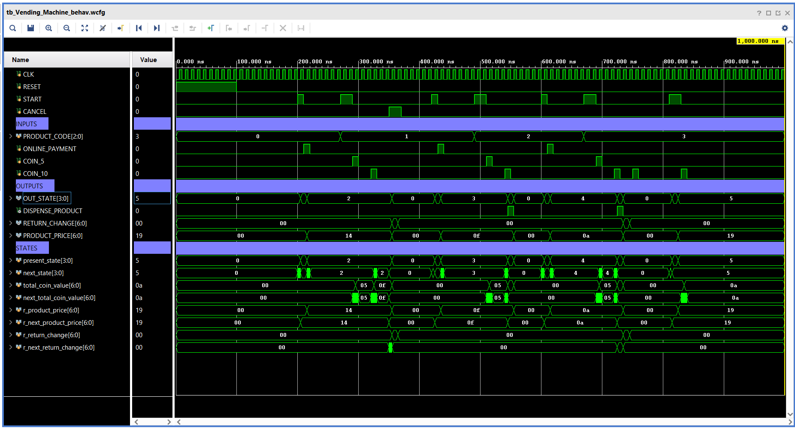

#  Vending Machine Controller using Verilog HDL


# Project Demonstration
<p align="center">
  <a href="https://youtu.be/de7Z4eadeas" target="_blank">
    
  </a>
</p> 
# Project Preview

<p align="center">

</p>


A Finite State Machine (FSM) based **Vending Machine Controller** implemented in **Verilog HDL**. This project simulates the behavior of a real vending machine capable of dispensing multiple products through **coin payment** or **online payment**, while supporting **transaction cancellation**, **automatic change return**, and **behavioral simulation using Xilinx Vivado**.

---

## 📌 Project Features

- ✅ Moore FSM-based controller
- ✅ Four selectable products
  - 🥤 Coke (₹20)
  - 🥤 Pepsi (₹15)
  - 💧 Water Bottle (₹10)
  - ☕ Coffee (₹25)
- ✅ Coin Payment (₹5 & ₹10)
- ✅ Online Payment
- ✅ Cancel Transaction
- ✅ Automatic Change Return
- ✅ Behavioral Simulation using Xilinx Vivado
- ✅ Comprehensive Verilog Testbench

---

# 📂 Project Structure

```
Vending_Machine_Verilog/
│
├── docs/
│   ├── project_overview.md
│   ├── design_explanation.md
│   ├── state_diagram.md
│   ├── state_table.md
│   ├── waveform_explanation.md
│   ├── VM_StateDiagram.png
│   └── VM_StateTable.png
│
├── src/
│   └── Vending_Machine.v
│
├── test_bench/
│   └── tb_Vending_Machine.v
│
├── waveforms/
│   ├── VendingMachine_Waveform.png
│   ├── VendingMachine_Waveform1.png
│   └── tb_Vending_Machine_behav.wdb
│
├── LICENSE
├── .gitignore
└── README.md
```

---

# ⚙️ Tools Used

- Verilog HDL
- Xilinx Vivado
- XSim Simulator
- Git
- GitHub

---

# 🏗️ FSM State Diagram

<p align="center">

</p>

---

# 📋 FSM State Table

<p align="center">

</p>

---

# 💰 Product Details

| Product | Product Code | Price |
|----------|--------------|------:|
| Coke | `000` | ₹20 |
| Pepsi | `001` | ₹15 |
| Water Bottle | `010` | ₹10 |
| Coffee | `011` | ₹25 |

---

# 🔄 State Encoding

| State | Binary |
|---------|--------|
| Initial State | `0000` |
| Product Selection State | `0001` |
| Coke Selection State | `0010` |
| Pepsi Selection State | `0011` |
| Water Bottle Selection State | `0100` |
| Coffee Selection State | `0101` |
| Dispense / Return State | `0110` |

---

# 💳 Payment Methods

### Coin Payment

Accepted Coins

- ₹5
- ₹10

The machine continuously accumulates the inserted amount until the selected product price is reached.

### Online Payment

The machine immediately proceeds to the dispense state after successful online payment.

---

# ❌ Cancel Operation

If the Cancel button is pressed before payment completion:

- Inserted coins are returned.
- Product dispensing is cancelled.
- Product price is cleared.
- FSM returns to the Initial State.

---

# 🧪 Simulation Results

The design has been verified using a dedicated Verilog testbench.

### Test Cases Performed

- ✅ Reset Operation
- ✅ Coke Purchase (Online Payment)
- ✅ Pepsi Cancel Transaction
- ✅ Water Bottle Return Change
- ✅ Coffee Coin Payment
- ✅ Coffee Insufficient Funds

---

# 📈 Behavioral Waveforms

### Simulation Waveform

<p align="center">

</p>

---

### Additional Waveform

<p align="center">

</p>

---

# 📁 Waveform Configuration

The complete Vivado waveform configuration is included.

```
waveforms/tb_Vending_Machine_behav.wdb
```

To view:

1. Open the project in Xilinx Vivado.
2. Run **Behavioral Simulation**.
3. Open the waveform configuration file:
   ```
   waveforms/tb_Vending_Machine_behav.wcfg
   ```

---

# 📚 Documentation

Detailed documentation is available in the **docs/** folder.

- 📄 Project Overview
- 📄 Design Explanation
- 📄 State Diagram
- 📄 State Table
- 📄 Waveform Explanation

---

# 🎯 Learning Outcomes

This project demonstrates:

- Finite State Machine (FSM) Design
- Sequential Logic Design
- Verilog HDL Programming
- RTL Simulation
- Testbench Development
- Digital System Verification
- Git & GitHub Documentation

---

# 👨‍💻 Author

**Loka Veera Sai Teja**

B.Tech Electronic Communication & Engineering

IIIT Sri City

---

## ⭐ If you found this project useful, consider giving it a Star!