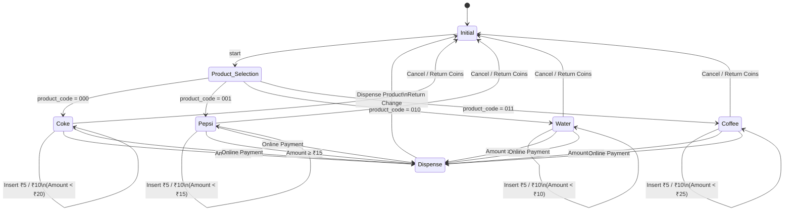

# Vending Machine FSM State Diagram

```mermaid
stateDiagram-v2

    [*] --> Initial

    Initial --> Product_Selection : start

    Product_Selection --> Coke : product_code = 000
    Product_Selection --> Pepsi : product_code = 001
    Product_Selection --> Water : product_code = 010
    Product_Selection --> Coffee : product_code = 011

    Coke --> Coke : Insert ₹5 / ₹10\n(Amount < ₹20)
    Coke --> Dispense : Amount ≥ ₹20
    Coke --> Dispense : Online Payment
    Coke --> Initial : Cancel / Return Coins

    Pepsi --> Pepsi : Insert ₹5 / ₹10\n(Amount < ₹15)
    Pepsi --> Dispense : Amount ≥ ₹15
    Pepsi --> Dispense : Online Payment
    Pepsi --> Initial : Cancel / Return Coins

    Water --> Water : Insert ₹5 / ₹10\n(Amount < ₹10)
    Water --> Dispense : Amount ≥ ₹10
    Water --> Dispense : Online Payment
    Water --> Initial : Cancel / Return Coins

    Coffee --> Coffee : Insert ₹5 / ₹10\n(Amount < ₹25)
    Coffee --> Dispense : Amount ≥ ₹25
    Coffee --> Dispense : Online Payment
    Coffee --> Initial : Cancel / Return Coins

    Dispense --> Initial : Dispense Product\nReturn Change
```